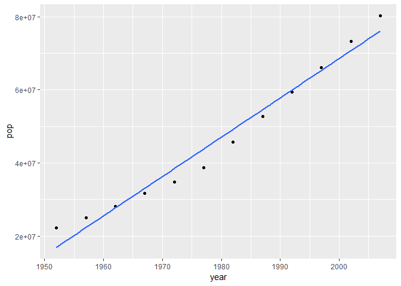
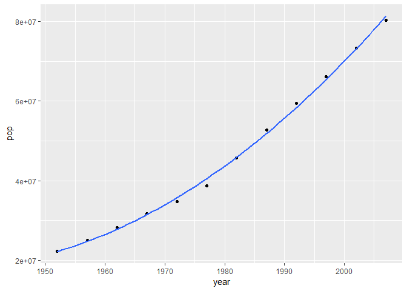
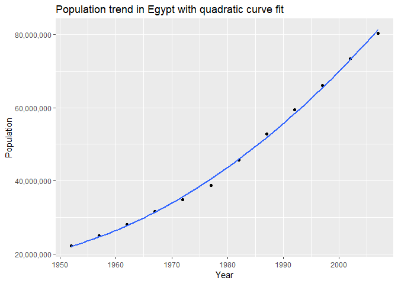
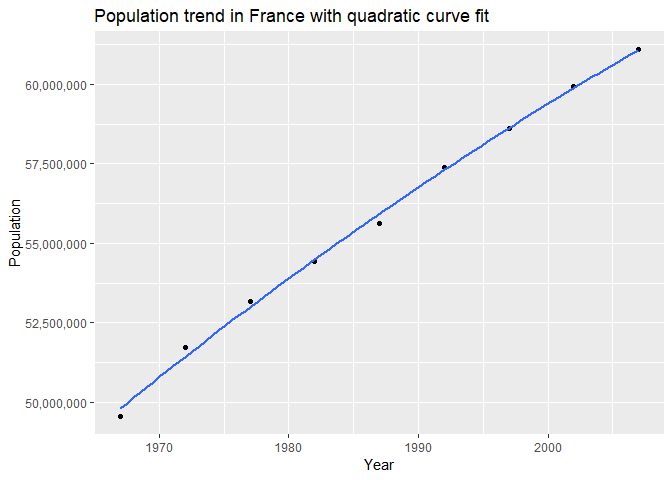

HW06: Data wrangling wrap up
================

-   [2. Writing Functions](#writing-functions)
    -   [Quadratic regression for population of a country](#quadratic-regression-for-population-of-a-country)
    -   [Suggesting Country Names](#suggesting-country-names)
-   [5. Work with a list](#work-with-a-list)
    -   [A lesson from the purr tutorial: Trump Android words](#a-lesson-from-the-purr-tutorial-trump-android-words)

First we load the relevant packages.

``` r
library(gapminder)
library(ggplot2)
library(stringr)
suppressPackageStartupMessages(library(dplyr))
suppressPackageStartupMessages(library(tidyverse))
suppressPackageStartupMessages(library(scales))
```

2. Writing Functions
--------------------

### Quadratic regression for population of a country

In this section, the goal is to write a function for the gapminder dataframe that returns a quadratic regression of population versus year for a specified country. The following is based on the tutorial from <http://stat545.com/block012_function-regress-lifeexp-on-year.html>

The inputs/outputs for the function we will create are the following:

-   **Input**: Country name, as a string
-   **Output**: A list of length 2, the first entry being the coefficients of the regression, the second a plot of the regression of population and year.

We will build the function step-by-step. First, let's explore a quadratic regression in ggplot; since this is preliminary investigations we will not add any titles or other aesthetics to the plot. In this case, let's choose Egypt as the country and plot how it's population varies with time.

``` r
country_choice <- "Egypt"
country_data <- gapminder %>% 
  filter(country == country_choice)

country_points <- ggplot(country_data, aes(x = year, y = pop)) + geom_point() 

country_points + geom_smooth(method = "lm", formula = (y ~ x + x^2), se = FALSE)
```



The fit certainly doesn't look quadratic! This is because we need to \`preserve' the structure of x^2 in the regression formula for geom\_smooth(), by using I():

``` r
country_points + 
  geom_smooth(method = "lm", formula = (y ~ I(x) + I(x^2)), se = FALSE)
```



Let's also find the parameters for this quadratic fit by piping into the function coef():

``` r
lm(pop ~ I(year) + I((year)^2), country_data) %>% 
  coef()
```

    ##   (Intercept)       I(year)   I((year)^2) 
    ## 42691340373.7   -44165686.3       11427.5

The intercept corresponds to the population at "year 0". We can see that the number does not make much sense! Therefore, it is perhaps more sensible to reparametrise so that the intercept occurs at the first year of our data. In this case, the first year is 1952, but in our function we can allow for other starting years. We can reparametrise via the subsitution y - 1952 &lt;- y , and check the regression makes more sense:

``` r
lm(pop ~ I(year-1952) + I((year-1952)^2), country_data) %>% 
  coef()
```

    ##        (Intercept)     I(year - 1952) I((year - 1952)^2) 
    ##         22176076.4           447280.2            11427.5

``` r
country_points + 
  geom_smooth(method = "lm", 
              formula = (y ~ I(x-1952) + I((x-1952)^2)), 
              se = FALSE)
```


Now to build the function. It will take as inputs a country name, and an offset (the year to begin)

``` r
quadratic_fit <- function(country_choice, offset = 1952){
  
  
  #filter gapminder to specified country and years
  data_filt <- filter(gapminder, gapminder$year >= offset, country == country_choice)

  #quadratic regression
  quad_regress <- lm(pop ~ I(year-offset) + I((year-offset)^2), data_filt)
  
  #make plot of year versus population for the chosen country
  plot <- ggplot(data_filt, aes(x = year, y = pop)) +
    #data points
    geom_point() +
    #quadratic fit determined earlier
    geom_smooth(method = "lm", 
                formula = (y ~ I(x-offset) + I((x-offset)^2)), 
                se = FALSE) +
    #labels
    labs(title = str_c("Population trend in" , country_choice, "with quadratic curve fit", sep = " "), 
         x = "Year", 
         y = "Population") +
    scale_y_continuous(labels = comma_format())
  
  #return a list with the coefficients of quadratic regression, and the above plot
  list(coef(quad_regress), plot)
}
```

Let's explore the function! Since the output is a list, recall we will access the contents of each entry using the double square brackets.

``` r
quadratic_fit("Egypt")[[1]]
```

    ##          (Intercept)     I(year - offset) I((year - offset)^2) 
    ##           22176076.4             447280.2              11427.5

``` r
quadratic_fit("Egypt")[[2]]
```



``` r
quadratic_fit("France", 1965)[[1]]
```

    ##          (Intercept)     I(year - offset) I((year - offset)^2) 
    ##         49148506.996           334530.824            -1201.746

``` r
quadratic_fit("France", 1965)[[2]]
```



Let's continue to add incremental parts to the function. One thing which we can do is to check for some errors. The first obvious error is if the input is not a string/character. The second error check is to throw an informative error if the inputted country does not exist. Let's add these error checks to our function.

``` r
quadratic_fit <- function(country_choice, offset = 1952){
  
  #preliminary checks for errors
  
  if (!is.character(country_choice)) {
      stop(paste("Expecting x to be a character. You gave me", typeof(country_choice)))
  }

  if(nrow(filter(gapminder, country == country_choice)) == 0){
      stop(paste(str_c("There is no country named", country_choice, "in the Gapminder dataframe", sep = " ")))
  }
  
  #filter gapminder to specified country and years
  data_filt <- filter(gapminder, gapminder$year >= offset, country == country_choice)

  #quadratic regression
  quad_regress <- lm(pop ~ I(year-offset) + I((year-offset)^2), data_filt)
  
  #make plot of year versus population for the chosen country
  plot <- ggplot(data_filt, aes(x = year, y = pop)) +
    #data points
    geom_point() +
    #quadratic fit determined earlier
    geom_smooth(method = "lm", 
                formula = (y ~ I(x-offset) + I((x-offset)^2)), 
                se = FALSE) +
    #labels
    labs(title = str_c("Population trend in" , country_choice, "with quadratic fit", sep = " "), 
         x = "Year", 
         y = "Population") +
    scale_y_continuous(labels = comma_format())
  
  #return a list with the coefficients of quadratic regression, and the above plot
  list(coef(quad_regress), plot)
}
```

To test an error (commented out because errors can't be knitted):

``` r
#quadratic_fit("Cenada")

#Error in quadratic_fit("Cenada") : There is no country named Cenada in the Gapminder dataframe
```

### Suggesting Country Names

We have some useful error messages. But what about making the error message possibly even predictive? Let's improve the error message above, by suggesting a country name (like in Google search). For example, we want our error message to be: "There is no country named Cenada in the Gapminder dataframe, did you mean Canada?"

For the suggestion part, the strategy is to take the user-inputted string, and separate it into its letters. Then we shall find all the country names with the same length, and separate those into letters. Then we can compare how many letters match, and choose the country in the gapminder dataframe with the most letters matching as the returned suggestion to the user.

To separate out the letters we have the following code:

``` r
country_choice <- "Csdfzq"
(split_letters <- str_split(country_choice, pattern = "")[[1]])
```

    ## [1] "C" "s" "d" "f" "z" "q"

(Note: str\_split returns a list of length 1, we choose the contents of the list.)

We also separate the letters for each country in the gapminder dataframe.

``` r
separate_country_letters <- unique(gapminder$country)  %>% 
  str_split(pattern = "")
```

Next, we find the countries which have the same length as the inputted country

``` r
(check_same_length <- map_dbl(separate_country_letters, length) == length(split_letters))
```

    ##   [1] FALSE FALSE FALSE  TRUE FALSE FALSE FALSE FALSE FALSE FALSE FALSE
    ##  [12] FALSE FALSE FALSE  TRUE FALSE FALSE FALSE FALSE FALSE  TRUE FALSE
    ##  [23] FALSE FALSE FALSE FALSE FALSE FALSE FALSE FALSE FALSE FALSE FALSE
    ##  [34] FALSE FALSE FALSE FALSE FALSE FALSE FALSE FALSE FALSE FALSE FALSE
    ##  [45]  TRUE FALSE  TRUE FALSE FALSE  TRUE FALSE  TRUE FALSE FALSE FALSE
    ##  [56] FALSE FALSE FALSE FALSE FALSE FALSE FALSE FALSE  TRUE FALSE FALSE
    ##  [67] FALSE  TRUE FALSE FALSE FALSE  TRUE FALSE FALSE FALSE FALSE FALSE
    ##  [78]  TRUE FALSE FALSE FALSE FALSE  TRUE FALSE FALSE FALSE FALSE FALSE
    ##  [89] FALSE FALSE FALSE FALSE FALSE FALSE FALSE  TRUE FALSE FALSE  TRUE
    ## [100] FALSE FALSE FALSE  TRUE FALSE FALSE FALSE FALSE  TRUE FALSE FALSE
    ## [111] FALSE  TRUE FALSE FALSE FALSE FALSE FALSE FALSE FALSE FALSE FALSE
    ## [122] FALSE  TRUE FALSE FALSE  TRUE FALSE FALSE FALSE FALSE FALSE  TRUE
    ## [133]  TRUE FALSE FALSE FALSE FALSE FALSE FALSE FALSE  TRUE FALSE

``` r
countries_with_same_length <- tibble(Country = unique(gapminder$country), `Matches Length?` = check_same_length) %>% 
  filter(`Matches Length?` == TRUE)

knitr::kable(countries_with_same_length)
```

| Country | Matches Length? |
|:--------|:----------------|
| Angola  | TRUE            |
| Brazil  | TRUE            |
| Canada  | TRUE            |
| France  | TRUE            |
| Gambia  | TRUE            |
| Greece  | TRUE            |
| Guinea  | TRUE            |
| Israel  | TRUE            |
| Jordan  | TRUE            |
| Kuwait  | TRUE            |
| Malawi  | TRUE            |
| Mexico  | TRUE            |
| Norway  | TRUE            |
| Panama  | TRUE            |
| Poland  | TRUE            |
| Rwanda  | TRUE            |
| Serbia  | TRUE            |
| Sweden  | TRUE            |
| Taiwan  | TRUE            |
| Turkey  | TRUE            |
| Uganda  | TRUE            |
| Zambia  | TRUE            |

Finally, we create a tibble with all the countries of the same length as the user-inputted one, and compare how many letters match.

``` r
(how_many_letters <- tibble(Country = separate_country_letters, `Matches length?` = check_same_length) %>% 
  filter(check_same_length == TRUE) )
```

    ## # A tibble: 22 x 2
    ##    Country   `Matches length?`
    ##    <list>    <lgl>            
    ##  1 <chr [6]> TRUE             
    ##  2 <chr [6]> TRUE             
    ##  3 <chr [6]> TRUE             
    ##  4 <chr [6]> TRUE             
    ##  5 <chr [6]> TRUE             
    ##  6 <chr [6]> TRUE             
    ##  7 <chr [6]> TRUE             
    ##  8 <chr [6]> TRUE             
    ##  9 <chr [6]> TRUE             
    ## 10 <chr [6]> TRUE             
    ## # ... with 12 more rows

``` r
#initialise the vector
(matching_letters <- numeric(length = length(how_many_letters$`Matches length?`)))
```

    ##  [1] 0 0 0 0 0 0 0 0 0 0 0 0 0 0 0 0 0 0 0 0 0 0

``` r
for (i in 1:length(how_many_letters$Country)){
  matching_letters[i] = sum(how_many_letters$Country[[i]] == split_letters)
}
matching_letters
```

    ##  [1] 0 0 1 0 0 0 0 1 0 0 0 0 0 0 0 0 0 0 0 0 0 0

Now we see which country has the most matching letters, we can go ahead and find the name of that country as our suggestion.

``` r
countries <- mutate(countries_with_same_length, Max = (matching_letters == max(matching_letters))) %>% 
  filter(Max == TRUE) 
 
#in case there exist more than one country with the same matching letters, we choose the first one:
as.character(countries$Country[1])
```

    ## [1] "Canada"

Let's put everything together in the function check\_country\_name:

``` r
check_country_name = function(country_choice){
 
(split_letters <- str_split(country_choice, pattern = "")[[1]])
  
  separate_country_letters <- unique(gapminder$country)  %>% 
  str_split(pattern = "")
  
  (check_same_length <- map_dbl(separate_country_letters, length) == length(split_letters))

countries_with_same_length <- tibble(Country = unique(gapminder$country), `Matches Length?` = check_same_length) %>% 
  filter(`Matches Length?` == TRUE)
  
(how_many_letters <- tibble(Country = separate_country_letters, `Matches length?` = check_same_length) %>% 
  filter(check_same_length == TRUE) )

#initialise the vector
(matching_letters <- numeric(length = length(how_many_letters$`Matches length?`)))

if (length(matching_letters) > 0){

  for (i in 1:length(how_many_letters$Country)){
    matching_letters[i] = sum(how_many_letters$Country[[i]] == split_letters)
  }
  countries <- mutate(countries_with_same_length, Max = (matching_letters == max(matching_letters))) %>% 
    filter(Max == TRUE) 
 
  #in case there exists more than one country with the same 
  #number of matching letters, we choose the first one:
  str_c("There is no country named", country_choice, "in the Gapminder dataframe. Did you mean", ... =       as.character(countries$Country[1]), "?", sep = " ")
}
else {
  str_c("There is no country named", country_choice, "in the Gapminder dataframe. I don't have any suggestions for you.", sep = " ")
}
}
```

Now we check different inputs. Two caveats are that it IS case-sensitive, which is not ideal, and also sensitive to the number of letters of the user input. We leave these things for future improvements :)

``` r
check_country_name("Kanada")
```

    ## [1] "There is no country named Kanada in the Gapminder dataframe. Did you mean Canada ?"

``` r
check_country_name("Ssdlkldf")
```

    ## [1] "There is no country named Ssdlkldf in the Gapminder dataframe. Did you mean Mongolia ?"

``` r
check_country_name("f")
```

    ## [1] "There is no country named f in the Gapminder dataframe. I don't have any suggestions for you."

``` r
check_country_name("Sldkfjssdfdjfkdjfklkdjf")
```

    ## [1] "There is no country named Sldkfjssdfdjfkdjfklkdjf in the Gapminder dataframe. I don't have any suggestions for you."

Now we can

5. Work with a list
-------------------

### A lesson from the purr tutorial: Trump Android words

In this section, we will work through the purr tutorial, "Trump Android words" from <https://jennybc.github.io/purrr-tutorial/ls08_trump-tweets.html>

The goal of this tutorial is to identify the occurrence of words (which we have preselected) in a collection of Trump tweets.

``` r
library(purrr)
suppressMessages(library(dplyr))
library(tibble)
```

There is a collection of Trump Android tweets stored in a R data file at the website <http://varianceexplained.org/files/trump_tweets_df.rda>

``` r
load(url("http://varianceexplained.org/files/trump_tweets_df.rda"))
#load("trump_tweets_df.rda")
glimpse(trump_tweets_df)
```

    ## Observations: 1,512
    ## Variables: 16
    ## $ text          <chr> "My economic policy speech will be carried live ...
    ## $ favorited     <lgl> FALSE, FALSE, FALSE, FALSE, FALSE, FALSE, FALSE,...
    ## $ favoriteCount <dbl> 9214, 6981, 15724, 19837, 34051, 29831, 19223, 1...
    ## $ replyToSN     <chr> NA, NA, NA, NA, NA, NA, NA, NA, NA, NA, NA, NA, ...
    ## $ created       <dttm> 2016-08-08 15:20:44, 2016-08-08 13:28:20, 2016-...
    ## $ truncated     <lgl> FALSE, FALSE, FALSE, FALSE, FALSE, FALSE, FALSE,...
    ## $ replyToSID    <lgl> NA, NA, NA, NA, NA, NA, NA, NA, NA, NA, NA, NA, ...
    ## $ id            <chr> "762669882571980801", "762641595439190016", "762...
    ## $ replyToUID    <chr> NA, NA, NA, NA, NA, NA, NA, NA, NA, NA, NA, NA, ...
    ## $ statusSource  <chr> "<a href=\"http://twitter.com/download/android\"...
    ## $ screenName    <chr> "realDonaldTrump", "realDonaldTrump", "realDonal...
    ## $ retweetCount  <dbl> 3107, 2390, 6691, 6402, 11717, 9892, 5784, 7930,...
    ## $ isRetweet     <lgl> FALSE, FALSE, FALSE, FALSE, FALSE, FALSE, FALSE,...
    ## $ retweeted     <lgl> FALSE, FALSE, FALSE, FALSE, FALSE, FALSE, FALSE,...
    ## $ longitude     <chr> NA, NA, NA, NA, NA, NA, NA, NA, NA, NA, NA, NA, ...
    ## $ latitude      <chr> NA, NA, NA, NA, NA, NA, NA, NA, NA, NA, NA, NA, ...

``` r
tweets <- trump_tweets_df$text
tweets %>% head() %>% strtrim(120)
```

    ## [1] "My economic policy speech will be carried live at 12:15 P.M. Enjoy!"                                                       
    ## [2] "Join me in Fayetteville, North Carolina tomorrow evening at 6pm. Tickets now available at: https://t.co/Z80d4MYIg8"        
    ## [3] "#ICYMI: \"Will Media Apologize to Trump?\" https://t.co/ia7rKBmioA"                                                        
    ## [4] "Michael Morell, the lightweight former Acting Director of C.I.A., and a man who has made serious bad calls, is a total C"  
    ## [5] "The media is going crazy. They totally distort so many things on purpose. Crimea, nuclear, \"the baby\" and so much more. "
    ## [6] "I see where Mayor Stephanie Rawlings-Blake of Baltimore is pushing Crooked hard. Look at the job she has done in Baltimo"

``` r
regex <- "badly|crazy|weak|spent|strong|dumb|joke|guns|funny|dead"
```

``` r
tweets <- tweets[c(1, 2, 5, 6, 198, 347, 919)]
tweets %>% strtrim(70)
```

    ## [1] "My economic policy speech will be carried live at 12:15 P.M. Enjoy!"   
    ## [2] "Join me in Fayetteville, North Carolina tomorrow evening at 6pm. Ticke"
    ## [3] "The media is going crazy. They totally distort so many things on purpo"
    ## [4] "I see where Mayor Stephanie Rawlings-Blake of Baltimore is pushing Cro"
    ## [5] "Bernie Sanders started off strong, but with the selection of Kaine for"
    ## [6] "Crooked Hillary Clinton is unfit to serve as President of the U.S. Her"
    ## [7] "The Cruz-Kasich pact is under great strain. This joke of a deal is fal"

``` r
matches <- gregexpr(regex, tweets)
str(matches)
```

    ## List of 7
    ##  $ : int -1
    ##   ..- attr(*, "match.length")= int -1
    ##   ..- attr(*, "index.type")= chr "chars"
    ##   ..- attr(*, "useBytes")= logi TRUE
    ##  $ : int -1
    ##   ..- attr(*, "match.length")= int -1
    ##   ..- attr(*, "index.type")= chr "chars"
    ##   ..- attr(*, "useBytes")= logi TRUE
    ##  $ : int 20
    ##   ..- attr(*, "match.length")= int 5
    ##   ..- attr(*, "index.type")= chr "chars"
    ##   ..- attr(*, "useBytes")= logi TRUE
    ##  $ : int 134
    ##   ..- attr(*, "match.length")= int 4
    ##   ..- attr(*, "index.type")= chr "chars"
    ##   ..- attr(*, "useBytes")= logi TRUE
    ##  $ : int [1:2] 28 95
    ##   ..- attr(*, "match.length")= int [1:2] 6 4
    ##   ..- attr(*, "index.type")= chr "chars"
    ##   ..- attr(*, "useBytes")= logi TRUE
    ##  $ : int [1:2] 87 114
    ##   ..- attr(*, "match.length")= int [1:2] 4 6
    ##   ..- attr(*, "index.type")= chr "chars"
    ##   ..- attr(*, "useBytes")= logi TRUE
    ##  $ : int [1:3] 50 112 123
    ##   ..- attr(*, "match.length")= int [1:3] 4 4 4
    ##   ..- attr(*, "index.type")= chr "chars"
    ##   ..- attr(*, "useBytes")= logi TRUE

``` r
matches[[7]]
```

    ## [1]  50 112 123
    ## attr(,"match.length")
    ## [1] 4 4 4
    ## attr(,"index.type")
    ## [1] "chars"
    ## attr(,"useBytes")
    ## [1] TRUE

``` r
lengths(matches)                      # just happens to exist for length
```

    ## [1] 1 1 1 1 2 2 3

``` r
#> [1] 1 1 1 1 2 2 3
sapply(matches, length)               # NSFP = not safe for programming
```

    ## [1] 1 1 1 1 2 2 3

``` r
#> [1] 1 1 1 1 2 2 3
vapply(matches, length, integer(1))   # preferred base approach
```

    ## [1] 1 1 1 1 2 2 3

``` r
#> [1] 1 1 1 1 2 2 3
map_int(matches, length)              # purrr way
```

    ## [1] 1 1 1 1 2 2 3

``` r
#> [1] 1 1 1 1 2 2 3
```

``` r
ml <- function(x) attr(x, which = "match.length")
match_length <- map(matches, ml)
```

``` r
#map(matches, ~ attr(.x, which = "match.length")) #approach 2
#(match_length <- map(matches, attr, which = "match.length")) #approach 3
```

``` r
map_int(matches, ~ sum(.x > 0))
```

    ## [1] 0 0 1 1 2 2 3

``` r
tibble(
  naive_length = lengths(matches),
  n_words = map_int(matches, ~ sum(.x > 0))
)
```

    ## # A tibble: 7 x 2
    ##   naive_length n_words
    ##          <int>   <int>
    ## 1            1       0
    ## 2            1       0
    ## 3            1       1
    ## 4            1       1
    ## 5            2       2
    ## 6            2       2
    ## 7            3       3

``` r
(match_first <- map(matches, as.vector))
```

    ## [[1]]
    ## [1] -1
    ## 
    ## [[2]]
    ## [1] -1
    ## 
    ## [[3]]
    ## [1] 20
    ## 
    ## [[4]]
    ## [1] 134
    ## 
    ## [[5]]
    ## [1] 28 95
    ## 
    ## [[6]]
    ## [1]  87 114
    ## 
    ## [[7]]
    ## [1]  50 112 123

``` r
(tweet <- tweets[7])
```

    ## [1] "The Cruz-Kasich pact is under great strain. This joke of a deal is falling apart, not being honored and almost dead. Very dumb!"

``` r
(t_first <- match_first[[7]])
```

    ## [1]  50 112 123

``` r
(t_length <- match_length[[7]])
```

    ## [1] 4 4 4

``` r
(t_last <- t_first + t_length - 1)
```

    ## [1]  53 115 126

``` r
substring(tweet, t_first, t_last)
```

    ## [1] "joke" "dead" "dumb"

``` r
(tweet <- tweets[1])
```

    ## [1] "My economic policy speech will be carried live at 12:15 P.M. Enjoy!"

``` r
(t_first <- match_first[[1]])
```

    ## [1] -1

``` r
(t_length <- match_length[[1]])
```

    ## [1] -1

``` r
(t_last <- t_first + t_length - 1)
```

    ## [1] -3

``` r
substring(tweet, t_first, t_last)
```

    ## [1] ""

``` r
(match_last <- map2(match_first, match_length, ~ .x + .y - 1))
```

    ## [[1]]
    ## [1] -3
    ## 
    ## [[2]]
    ## [1] -3
    ## 
    ## [[3]]
    ## [1] 24
    ## 
    ## [[4]]
    ## [1] 137
    ## 
    ## [[5]]
    ## [1] 33 98
    ## 
    ## [[6]]
    ## [1]  90 119
    ## 
    ## [[7]]
    ## [1]  53 115 126

``` r
pmap(list(text = tweets, first = match_first, last = match_last), substring)
```

    ## [[1]]
    ## [1] ""
    ## 
    ## [[2]]
    ## [1] ""
    ## 
    ## [[3]]
    ## [1] "crazy"
    ## 
    ## [[4]]
    ## [1] "joke"
    ## 
    ## [[5]]
    ## [1] "strong" "weak"  
    ## 
    ## [[6]]
    ## [1] "weak"   "strong"
    ## 
    ## [[7]]
    ## [1] "joke" "dead" "dumb"

``` r
mdf <- tibble(
  text = tweets,
  first = match_first,
  last = match_last
)
mdf
```

    ## # A tibble: 7 x 3
    ##   text                                                    first    last   
    ##   <chr>                                                   <list>   <list> 
    ## 1 My economic policy speech will be carried live at 12:1~ <int [1~ <dbl [~
    ## 2 Join me in Fayetteville, North Carolina tomorrow eveni~ <int [1~ <dbl [~
    ## 3 "The media is going crazy. They totally distort so man~ <int [1~ <dbl [~
    ## 4 I see where Mayor Stephanie Rawlings-Blake of Baltimor~ <int [1~ <dbl [~
    ## 5 Bernie Sanders started off strong, but with the select~ <int [2~ <dbl [~
    ## 6 Crooked Hillary Clinton is unfit to serve as President~ <int [2~ <dbl [~
    ## 7 The Cruz-Kasich pact is under great strain. This joke ~ <int [3~ <dbl [~

``` r
pmap(mdf, substring)
```

    ## [[1]]
    ## [1] ""
    ## 
    ## [[2]]
    ## [1] ""
    ## 
    ## [[3]]
    ## [1] "crazy"
    ## 
    ## [[4]]
    ## [1] "joke"
    ## 
    ## [[5]]
    ## [1] "strong" "weak"  
    ## 
    ## [[6]]
    ## [1] "weak"   "strong"
    ## 
    ## [[7]]
    ## [1] "joke" "dead" "dumb"

``` r
tibble(text = tweets,
       first = gregexpr(regex, tweets)) %>% 
  mutate(match_length = map(first, ~ attr(.x, which = "match.length")),
         last = map2(first, match_length, ~ .x + .y - 1)) %>%
  select(-match_length) %>% 
  pmap(substring)
```

    ## [[1]]
    ## [1] ""
    ## 
    ## [[2]]
    ## [1] ""
    ## 
    ## [[3]]
    ## [1] "crazy"
    ## 
    ## [[4]]
    ## [1] "joke"
    ## 
    ## [[5]]
    ## [1] "strong" "weak"  
    ## 
    ## [[6]]
    ## [1] "weak"   "strong"
    ## 
    ## [[7]]
    ## [1] "joke" "dead" "dumb"
